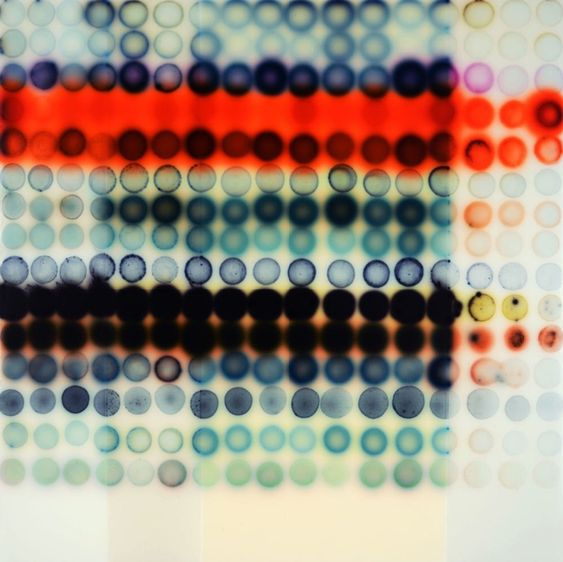
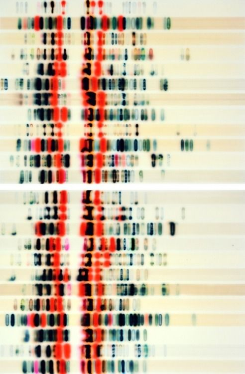
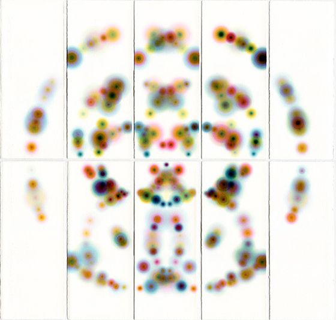

# mzha0931_9103_tut5

# Quiz 8
## Part 1: Imaging Technique Inspiration
**Artwork I chose:**

**Inspiratio:**

## Part 2:  Coding Technique Exploration

### Head 3
#### Head 4
##### Head 5
###### Head 6

**Boad**

*Italic*

- Order1
 - Order 1.1
 - Order 1.2
- Order 2

1. First
2. Second

[Google](https://www.google.com)

